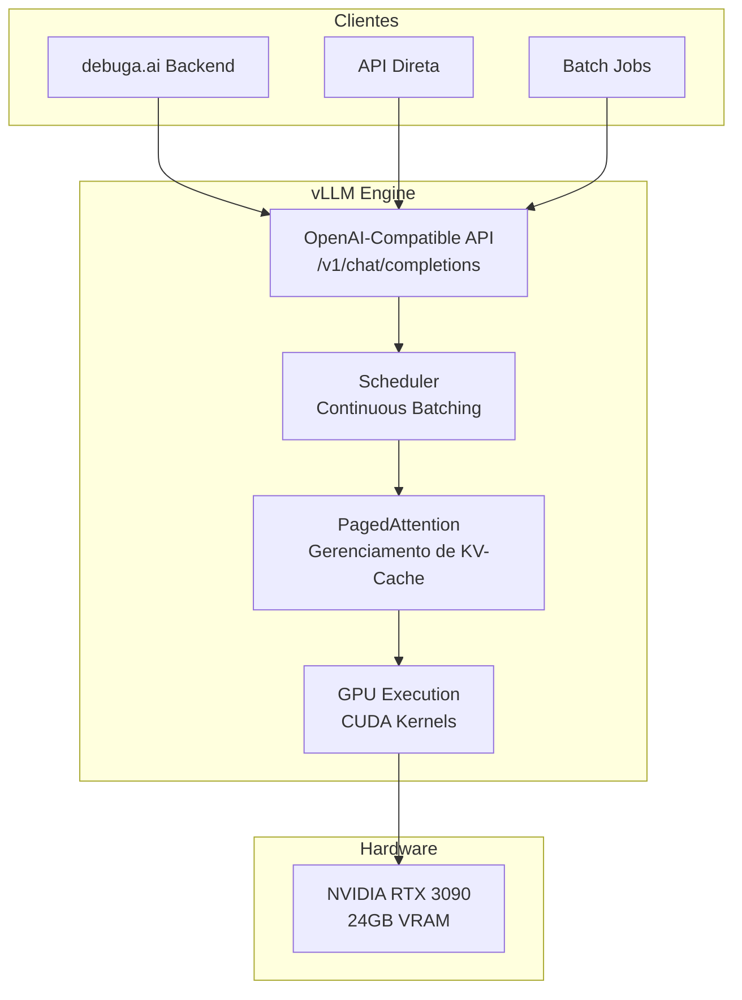
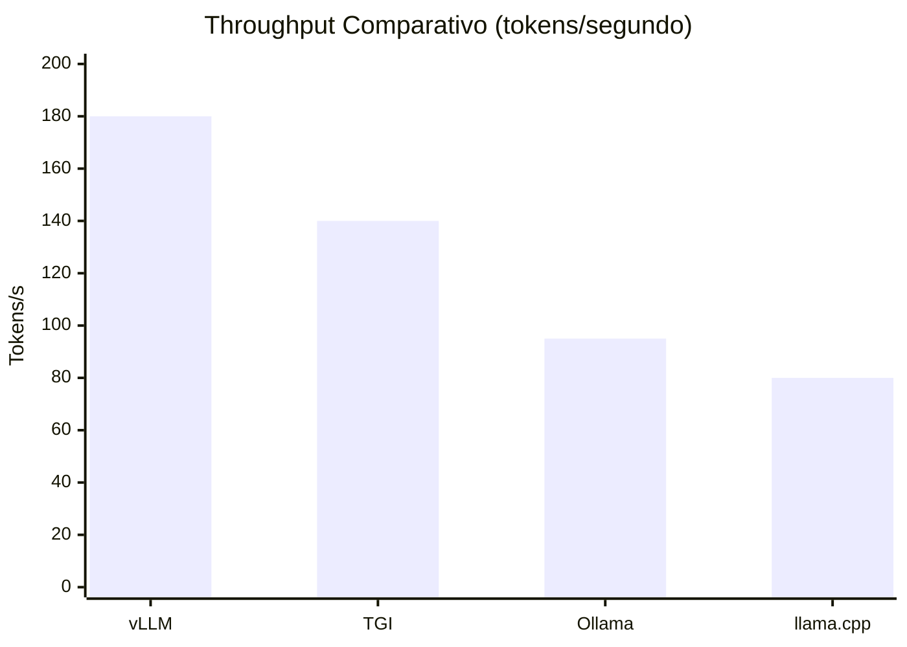
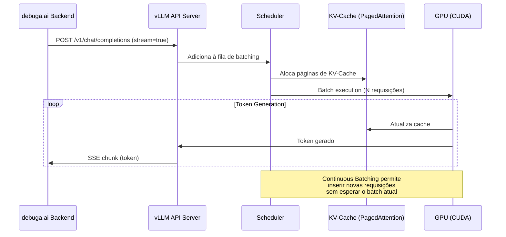
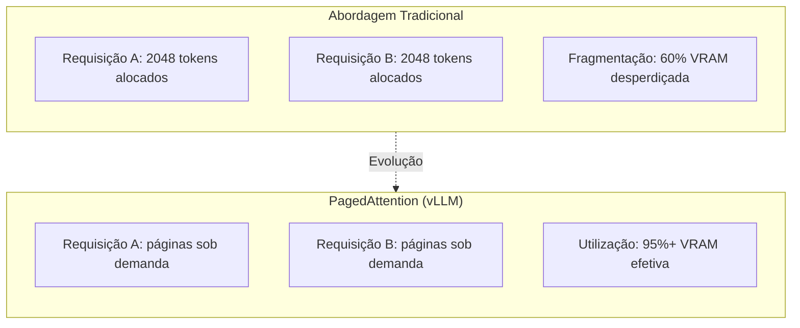
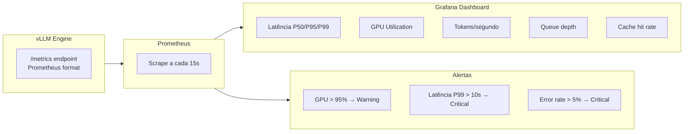
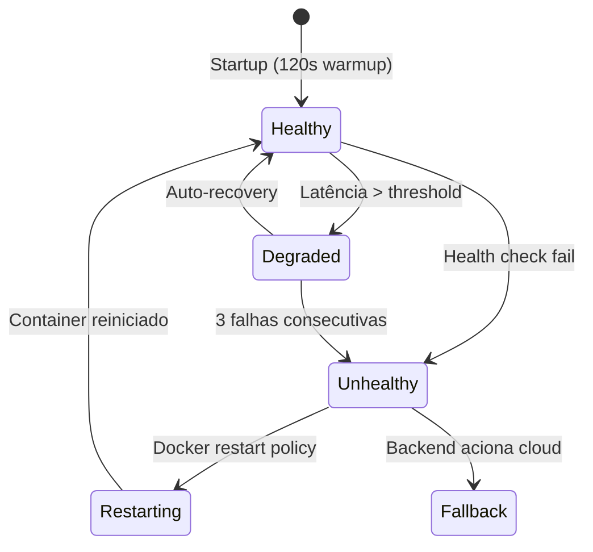

# debuga-vllm-engine

**Configuração de produção do motor de inferência vLLM para serving de modelos LLM com alta concorrência e baixa latência.**

Desenvolvido por [Sperry Tecnologia](https://www.sperrytecnologia.com.br).

---

## Visão Geral

Este repositório contém as configurações, scripts e documentação para deploy do [vLLM](https://github.com/vllm-project/vllm) como motor de inferência da plataforma [debuga.ai](https://debuga.ai). O vLLM implementa **PagedAttention** e **Continuous Batching**, permitindo servir múltiplas requisições simultâneas com throughput superior a frameworks tradicionais.



---

## Por que vLLM?



| Motor | Throughput | Concurrent Users | PagedAttention | Continuous Batching |
|-------|-----------|------------------|----------------|---------------------|
| **vLLM** | 180 tok/s | 50+ | Sim | Sim |
| TGI | 140 tok/s | 30+ | Parcial | Sim |
| Ollama | 95 tok/s | 5-10 | Não | Não |
| llama.cpp | 80 tok/s | 1-3 | Não | Não |

> O vLLM foi selecionado por oferecer o melhor throughput em cenários de alta concorrência, essencial para uma plataforma multi-tenant.

---

## Arquitetura de Serving



---

## PagedAttention — Gerenciamento de Memória



| Métrica | Sem PagedAttention | Com PagedAttention | Melhoria |
|---------|-------------------|-------------------|----------|
| Utilização VRAM | 40-60% | 90-95% | +50% |
| Concurrent requests | 5-10 | 30-50+ | +5x |
| Throughput | 80 tok/s | 180 tok/s | +2.25x |
| Latência P99 | 8s | 3s | -62% |

---

## Configurações de Produção

### Modelo Primário

```yaml
model: Qwen/Qwen2.5-Coder-7B-Instruct
tensor_parallel_size: 1
gpu_memory_utilization: 0.90
max_model_len: 8192
dtype: auto
trust_remote_code: true
```

### Parâmetros de Performance

| Parâmetro | Valor | Justificativa |
|-----------|-------|---------------|
| `gpu-memory-utilization` | 0.90 | Máximo sem OOM |
| `max-model-len` | 8192 | Suficiente para código + contexto |
| `tensor-parallel-size` | 1 | Single GPU (RTX 3090) |
| `enforce-eager` | false | Permite CUDA graphs |
| `max-num-seqs` | 64 | Batch size máximo |
| `swap-space` | 4 | GB de swap para overflow |

---

## Métricas e Monitoramento



| Métrica | Descrição | Threshold |
|---------|-----------|-----------|
| `vllm:request_latency_seconds` | Latência end-to-end | P95 < 5s |
| `vllm:num_requests_running` | Requisições em execução | < 50 |
| `vllm:num_requests_waiting` | Fila de espera | < 20 |
| `vllm:gpu_cache_usage_perc` | Uso do KV-Cache | < 95% |
| `vllm:avg_generation_throughput` | Tokens por segundo | > 100 |

---

## Health Check e Auto-Recovery



---

## Deploy

```bash
# 1. Clone
git clone https://github.com/SperryTecnologia/debuga-vllm-engine.git
cd debuga-vllm-engine

# 2. Configure
cp configs/.env.example .env
# Edite com HF_TOKEN e parâmetros desejados

# 3. Build e start
docker compose up -d

# 4. Verifique saúde
curl http://localhost:8000/health

# 5. Teste inferência
curl http://localhost:8000/v1/chat/completions \
  -H "Content-Type: application/json" \
  -d '{
    "model": "Qwen/Qwen2.5-Coder-7B-Instruct",
    "messages": [{"role": "user", "content": "Write a Dockerfile for Node.js"}],
    "stream": true
  }'
```

---

## Estrutura do Repositório

```
debuga-vllm-engine/
├── configs/              # Configurações por ambiente
├── docker/               # Dockerfile customizado + compose
├── scripts/              # Scripts de deploy e manutenção
├── monitoring/           # Prometheus + Grafana configs
├── docs/                 # Documentação detalhada
└── README.md
```

---

## Troubleshooting

| Problema | Causa | Solução |
|----------|-------|---------|
| OOM (Out of Memory) | VRAM insuficiente | Reduzir `gpu-memory-utilization` ou `max-model-len` |
| Cold start lento | Download do modelo | Usar volume persistente para cache |
| Latência alta | Batch muito grande | Ajustar `max-num-seqs` |
| Tokens/s baixo | Modelo grande demais | Considerar quantização (AWQ/GPTQ) |

---

## Repositórios Relacionados

| Repositório | Descrição |
|-------------|-----------|
| [debuga-ai](https://github.com/SperryTecnologia/debuga-ai) | Plataforma principal |
| [debuga-llm-stack](https://github.com/SperryTecnologia/debuga-llm-stack) | Estratégia LLM híbrida (GPU + cloud) |
| [debuga-qwen-coder-lab](https://github.com/SperryTecnologia/debuga-qwen-coder-lab) | Avaliação de modelos para code generation |
| [debuga-llm-gateway](https://github.com/SperryTecnologia/debuga-llm-gateway) | Gateway OpenAI-compatible |

---

## Licença

Configurações e documentação sob licença MIT. O código de produção da plataforma é mantido em repositório privado.

---

*Sperry Tecnologia — Infraestrutura, segurança, DevOps e automação com IA.*
